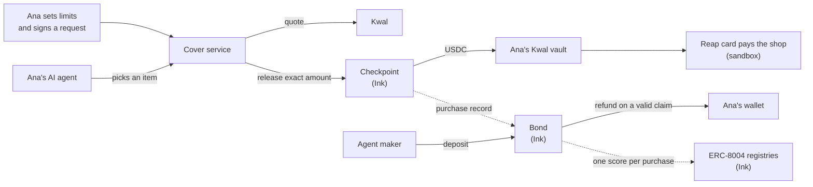

# Cover

**A money-back guarantee for AI agent purchases.** Limits stop the money. The bond fixes the mistakes.

When a shopping agent buys the wrong thing, the shopper pays for it today. Target's terms now treat agent purchases as "authorized by you", and 93% of merchants say the agent's maker should carry the loss. Cover makes that real: the agent's maker puts up a USDC deposit, the shopper's signed request is checked onchain before any money moves, and a wrong item is refunded from the maker's deposit in seconds.

Built in one evening for the **Reap × 65labs Agentic Buildathon** (9 Oct 2026) on **Ink Sepolia** (chain ID `763373`), paying through **Kwal**, Payward's non-custodial agent wallet with Reap's Agentic card.

> **Video:** _link to come_ · **Demo script:** [docs/DEMO_SCRIPT.md](docs/DEMO_SCRIPT.md) · **Product brief:** [COVER_PLAN.html](COVER_PLAN.html)

---

## The 30-second version

> Ana asks her agent for **the black PowerBug 25W, under $60**. The agent takes the shop's default, **White/Dune**, and pays.
> Ana taps **Wrong item**. The Bond contract compares what she signed (`black`) with what was bought (`white/dune`), refunds her from the maker's deposit, and writes a 0 to the agent's public ERC-8004 score.
> The agent's fee goes up and the most it may buy without asking goes down.

## How it works



1. **The maker's deposit.** The agent's maker locks USDC in the **Bond**. An agent can only make covered purchases up to the part of its deposit that isn't already backing other purchases.
2. **Ana's limits.** Ana keeps her USDC in the **Checkpoint** and sets her limits once: per-item cap, monthly cap, allowed shops, her shipping address, an end date. An unset limit means *no allowance*, never unlimited.
3. **Ana's request.** For each purchase her wallet signs an EIP-712 `PurchaseRequest`: shop, item, colour, size, model, the most she'll pay, her address hash, a nonce and a deadline ([shared/purchase-request.json](shared/purchase-request.json)).
4. **The checkpoint.** The agent picks an item and Kwal quotes it. The service checks every rule off-chain first, then the Checkpoint checks them all again on `release` and moves the exact quoted amount to Ana's Kwal vault. A refused request reports **every** failed rule at once ("amount, shop, address") and moves nothing.
5. **The payment.** Kwal sees the vault funded and pays the shop with the Reap card. The service records the outcome on the Checkpoint.
6. **The claim.** During the claim window Ana can tap **Wrong item**. The Bond compares her signed fields with the bought ones. Mismatch: refund from the deposit, score 0. Match: claim rejected, score 100. No claim: the reserve is released, score 100.

### What the maker pays

| | |
|---|---|
| Cover fee per purchase | `50 + 5 × (100 − score)` basis points: **0.5%** at a perfect score, up to 5.5% |
| Auto-pay limit (score bands) | 90+: Ana's per-item cap · 60–89: $50 · under 60: $0 (Ana approves every purchase) |
| Refunds | Always from the maker's deposit, never from Cover |

**A maker-backed guarantee, not insurance.** Cover never pays a refund from its own money.

### Security model

- The agent holds no keys, no card data and no control over the address. It can only *propose* an item.
- Ana's limits and her signature are enforced **in the contract**, not just in the service.
- The service key can release only what Ana signed, to Ana's own vault, within her limits.
- The Bond is a feedback client of the ERC-8004 Reputation Registry, never an owner or operator, so it can't score its own agent.

---

## What's real and what's simulated

| Real | Simulated or simplified |
|---|---|
| **Checkpoint** and **Bond** deployed on Ink Sepolia (addresses below) | **The demo video runs in simulation mode** (`PAYMENTS_MODE=fake`): payment events and maker numbers come from the service, not the chain, because the demo agent wasn't registered and Ana's in-app wallet wasn't funded in time |
| **ERC-8004** Identity and Reputation registries: our own deployment of the reference contracts, unchanged | Test USDC on a testnet; Kwal sandbox, so the card spend is real in the sandbox and nothing ships |
| A **real Kwal checkout**: payment `pay_de230427f0194287b77669bbf393ef16`, 15.73 USDC, completed 23 s after submit with no approval link | Our service reports what was bought (a trust assumption; in production the shop would sign its item data) |
| A **contract transfer counts as Kwal vault funding** (measured: ~38 s) | The claim window (180 s) and withdrawal delay (300 s) are shortened for the demo |
| The full onchain flow (release → fee → confirm → refund, fair claim rejected, score drop → `NeedsApproval` → Ana's approval) proven against the **compiled contracts** in `service/payments/tests/test_chain_anvil.py` | The demo agent is told to take the shop's default variant when unsure, which is how the wrong item happens |
| Every rule enforced twice: in Python (`service/guard`) and in Solidity, with laeria's 19 cases in both | "Month" means 30-day periods; ERC-8004 averages truncate (200/3 = 66) |

**Known limit: exact labels.** A claim compares labels exactly. "Black" against "White/Dune" is clear; "Black" against "Midnight" would refund even if Midnight is black. The demo items have plain labels. Production would take labels from the shop's own option list (e.g. `slate/black`) and need shop-signed attributes.

**Pricing.** Sandbox pricing is off on our Kwal gateway, so quotes carry real shipping and tax. Limits compare the larger of the listed price and the quoted total, so shipping can't slip past Ana's caps.

---

## Contracts (Ink Sepolia, 763373)

| Contract | Address |
|---|---|
| Checkpoint | [`0xc13A5B8857cE7F4E20A176A03925E2efA68Ef0af`](https://explorer-sepolia.inkonchain.com/address/0xc13A5B8857cE7F4E20A176A03925E2efA68Ef0af) |
| Bond | [`0x872597FF7BF4AA143C21126b50557022BC3ee351`](https://explorer-sepolia.inkonchain.com/address/0x872597FF7BF4AA143C21126b50557022BC3ee351) |
| ERC-8004 Identity Registry | [`0x5fE095dA5C7Bd3E80E28e59F1e43D250D3e7B620`](https://explorer-sepolia.inkonchain.com/address/0x5fE095dA5C7Bd3E80E28e59F1e43D250D3e7B620) |
| ERC-8004 Reputation Registry | [`0x891513a8C901916D57833201bC2720a63E349a60`](https://explorer-sepolia.inkonchain.com/address/0x891513a8C901916D57833201bC2720a63E349a60) |
| Test USDC | [`0xFabab97dCE620294D2B0b0e46C68964e326300Ac`](https://explorer-sepolia.inkonchain.com/address/0xFabab97dCE620294D2B0b0e46C68964e326300Ac) |

Addresses and ABIs live in [deployments/ink-sepolia.json](deployments/ink-sepolia.json); nothing in the code hard-codes them.

---

## Run it

Requirements: Node.js 22.13+ (`.nvmrc`), npm 10, Python 3.10+ (3.12 recommended), Foundry. The Kwal client needs Linux, so on Windows run the service in WSL.

```sh
git clone --recurse-submodules https://github.com/jaydonnnk/CoverMe.git
cd CoverMe
cp .env.example .env
npm --prefix app ci
python3 -m venv .venv && source .venv/bin/activate
python -m pip install -r service/requirements-dev.txt
```

Start the service (simulation mode needs no keys) and the app in two terminals:

```sh
PAYMENTS_MODE=fake python -m uvicorn service.main:app --port 8000
```

```sh
npm --prefix app run dev
```

Open http://localhost:3000, press **Reset rehearsal**, then follow [docs/DEMO_SCRIPT.md](docs/DEMO_SCRIPT.md).

Live mode (`PAYMENTS_MODE=live`) needs the keys in `.env.example`, a registered agent in `deployments/ink-sepolia.json`, a funded Bond and Kwal credentials outside the repo.

### Tests

```sh
python -m pytest -q                 # guard, payments, chain (anvil tests skip without Foundry)
cd contracts && forge fmt --check && forge build && forge test
```

CI runs the app's lint, types and build, the Python tests, the Foundry checks and the ERC-8004 reference tests on every PR. It sends no transactions and needs no secrets.

---

## Repository

```text
contracts/       Foundry: Checkpoint.sol, Bond.sol, tests (incl. laeria's 19 cases), deploy scripts
  lib/erc-8004-contracts/   ERC-8004 reference registries, unchanged (submodule)
service/         FastAPI: chat agent, runner, SSE ledger, claims
  guard/         signed-request check, rules, spend ceiling (ported from laeria)
  payments/      Kwal client, pay() flow, web3 chain calls
  fixtures/      recorded Kwal responses for replay
app/             Next.js: Ana's screen, maker screen, ledger, receipt
shared/          the interfaces and the EIP-712 definition both sides use
deployments/     addresses and ABIs per network
scripts/         payment smoke test, deployment writer
docs/            demo script
```

## Prior work: reused from laeria.ai

Cover reuses code from **laeria.ai** (StraitsX Agentic Playground, Aug 2026), ported and adapted:

| laeria | Cover |
|---|---|
| `backend/services/delegation.py` (signed mandate) | [service/guard/signing.py](service/guard/signing.py): EIP-712 `PurchaseRequest`, recovered signer must be the shopper |
| `backend/services/payment.py:53`, `backend/core/models.py:121` (mandate rules) | [service/guard/rules.py](service/guard/rules.py) and [contracts/src/Checkpoint.sol](contracts/src/Checkpoint.sol): every failure reported, unset means deny |
| `backend/api/routes/actions.py:345-361` (spend ceiling) | [service/guard/ceiling.py](service/guard/ceiling.py): one `min()` over every limit, including the maker's free cover |
| `backend/tests/test_mandate.py` (19 tests) | the same 19 cases in pytest (`service/guard/tests/`) and Foundry (`contracts/test/Checkpoint.t.sol`) |
| record-and-replay fixtures | [service/fixtures/](service/fixtures/) and `kwal.use_replay()` |
| `docs/DEMO_SCRIPT.md` | [docs/DEMO_SCRIPT.md](docs/DEMO_SCRIPT.md) |

Everything else (the contracts, the Bond, the Kwal integration, the claim and score logic, the app) is new.

## Team

- **Jaydon Kua**: payments, Kwal, the Checkpoint and Bond contracts, chain calls, the laeria ports, demo tooling.
- **Francesco**: ERC-8004 registries and agent registration, the FastAPI service, the agent, the Next.js app.

See [CONTRIBUTING.md](CONTRIBUTING.md) for folder ownership and branches. Never commit keys; use only test wallets that have never held real money.
